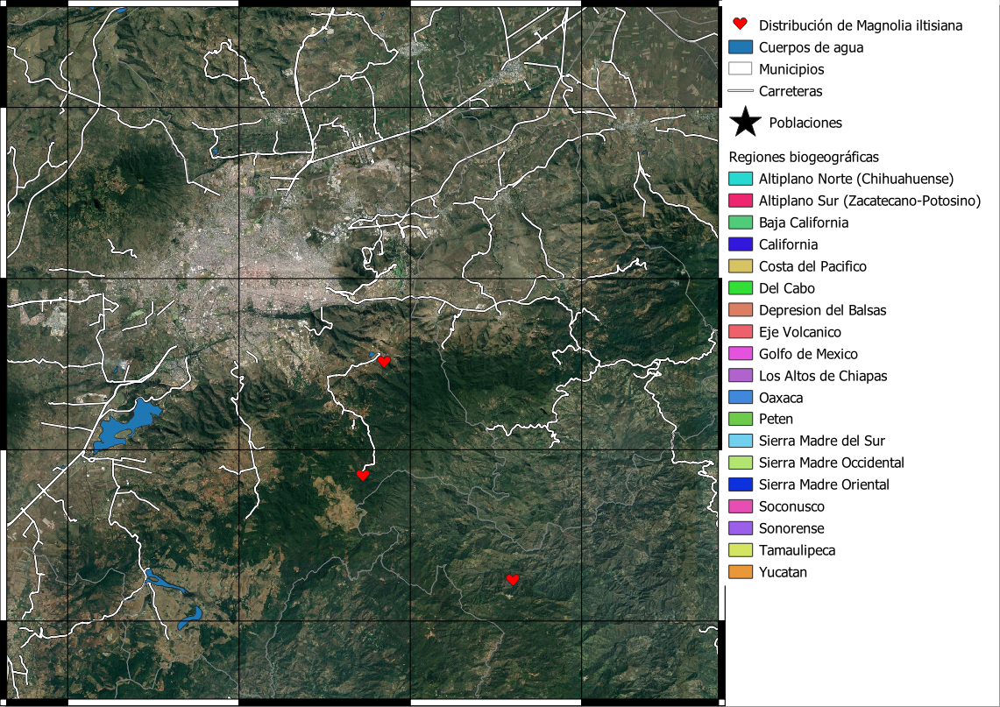
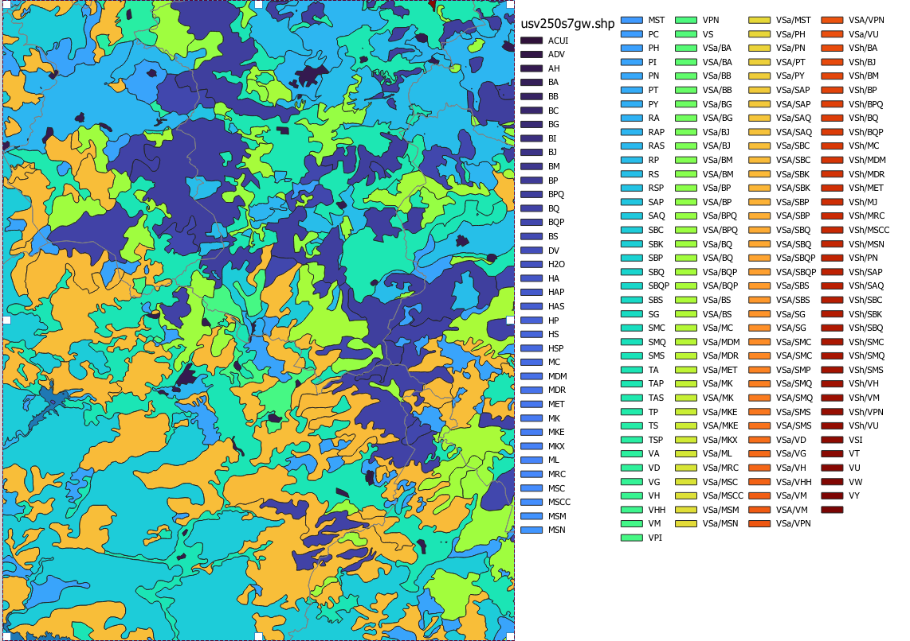
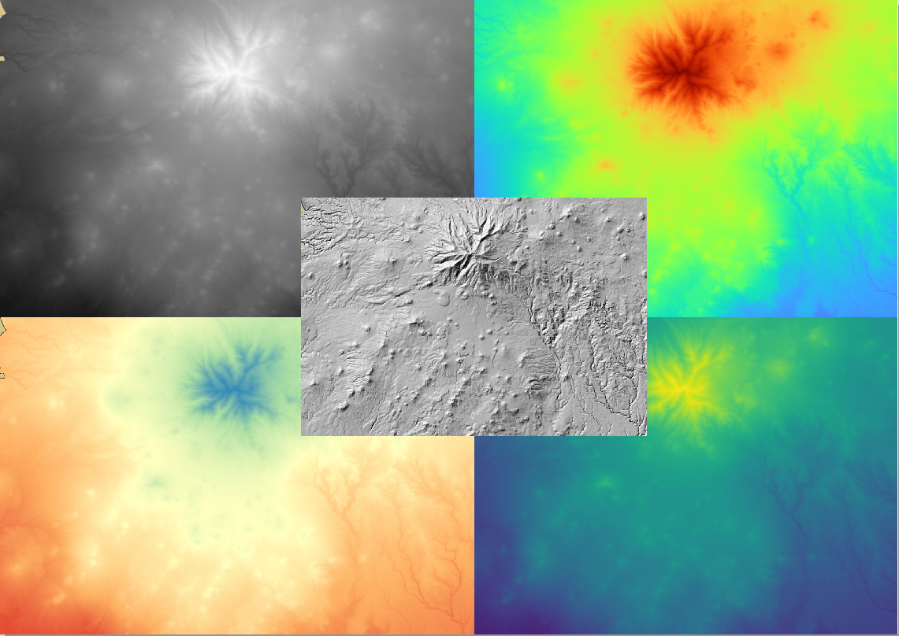

[Volver al inicio](index.md)

## Introducción

Como se mencionó en el indice, el objetivo de esta guía es ayudar a las personas que realizan investigación o qué desarrollan algún proyecto o tesis, a crear un mapa de este. Pero ¿por qué es tan importante crear un buen mapa?. Te daré tres argumentos para tratar de explicar por qué, en mi opinión, es importante crear una figura que represente de forma apropiada a nuestro proyecto.

### Replicabilidad

Como personas que nos dedicamos a la ciencia, sabemos que uno de los principales factores que diferencian a esta de otros conocimientos y actividades humanas es la replicabilidad. La replicabilidad es, a grandes razgos, la capacidad de poder repetir un estudio obteniendo los mismo resultados. Para que esto sea así, se debe de contar con toda la información posible del estudio original. Esto puede incluir sitio(s) de estudio, numero de muestras, condiciones ambientales en donde fueron tomados, etc. Si bien esta información puede (y debería) ir en el texto de nuestro manuscrito, una buena figura (como un mapa) nos puede ayudar a explicar de manera rápida y sencilla gran parte de estos aspectos.

### Accesibilidad

El conocimiento guardado no es conocimiento. Los hallázgos de un trabajo científico de cualquier tipo deberían de ser compartidos tanto entre la comunidad científica como a la población general. Para esto nos puede ser de gran ayuda una figura que, de manera breve y sencilla, nos explique cuales fueron los principales resultados de dicho estudio. En muchos casos, un mapa puede cumplir con este trabajo. Sin embargo, para esto la figura debe de contar con información clara que pueda ser comprendida por cualquier persona.

### Estética

No sólo de pan vive el hombre y no de pragmatismo vive la ciencia. Además de servir a un proposito utilitario, una figura también puede ser una forma de expresar la parte más bonita de nuestro proyecto. Así como una figura bonita y llamativa puede ser un foco que llame a otras personas a leer nuestra investigación, una figura fea o sin gracia puede ser la razón para que los lectores pasen de largo de nuestro artículo, poster o presentación. Así que tampoco hay que dejar de lado este aspecto.

## ¿Cómo creamos una buena figura?

Crear un buen mapa realmente no es difícil. Sólo hay que tener en mente algunas pautas básicas relacionadas con los aspectos de la replicabilidad, accesibilidad y estética.

Nuestro mapa, como apoyo para la replicabilidad de nuestro trabajo, debe de poseer la información necesaria para que se pueda llevar a cabo un estudio similar al nuestro. Lo mínimo que habriamos de proporcionar en nuestro mapa serían las coordenadas de nuestro estudio. Sea un sitio de estudio o multiples puntos de colecta es importante que incluso una persona que no esté familiarizada con la zona pueda ubicarlos. Además de esto, es muy útil dar el contexto que se relaciona a estos puntos, empezando por en qué parte del munto estamos localizados, en qué país, estado, provincia, etc.

Adicional a un contexto global y una georreferenciación, es útil dar un contexto local del(los) sitio(s) de estudio. Dependiendo del tema que estemos tratando, podríamos incluir información del relieve, la vegetación, cuerpos de agua, vías de comunicación, poblaciones humanas, actividades agricolas, etc. Qué incluir en el mapa está relacionado a lo que queremos comunicar en nuestro mapa.

Con relación a la accesibilidad, es importante tomar en cuenta que la figura debería poder ser comprendida tanto por expertos del area en donde nos estemos desarrollando como por expertos en áreas relacionadas. Además, dependiendo del objetivo del mapa, también podríamos buscar que la información sea entendible por personas del público en general. Aunque esto último no sea posible en todos los casos, es importante hacer las modificaciones necesarias cuando se desarrollen actividades de comunicación de la ciencia.

Otro punto relacionado a la accesibilidad es la necesidad de adecuar nuestras figuras para personas con capacidades visuales diferentes. Para este aspecto es importante tomar en cuenta las [combinaciones de colores](https://betterfigures.org/2015/06/23/picking-a-colour-scale-for-scientific-graphics/) que utilizamos en nuestras figuras.

Finalmente, debido a su componente subjetivo, el aspecto estético estará dado por el ojo del observador. Sin embargo, dado que nuestras proyectos generalmente contienen una gran cantidad de datos e información es fácil dejarse llevar y querer agregar todo esto en una figura. Siguiendo algo como el principio KISS o un estilo minimalista, muchas veces es mejor crear dos figuras sencillas que una figura rebuscada y compleja.

