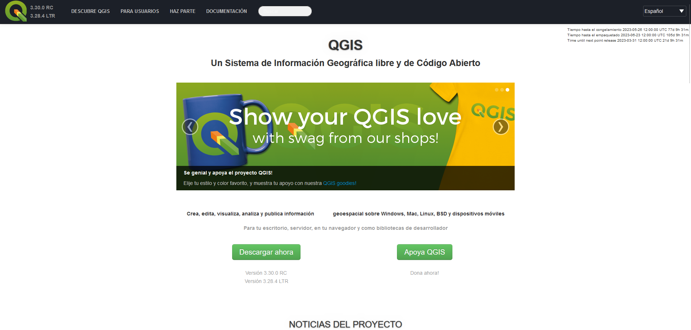

[Volver al inicio](index.md)

## Introducción

QGIS es un Sistema de Información Geográfica Open Source y gratuito. Está disponible para Windows, Linux, MacOS y Android. En la acutalidad QGIS es uno de los SIG más utilizados y poderosos. Esto gracias a que cuenta con diversos complementos y la capacidad de ejecutar scripts de python lo que hace que las posibilidades sean enormes. 
Aún así, QGIS cuenta con una interfáz de usuario "amigable" y una amplia documentación que permite que sea usado por cualquier usuario sin importar su nivel de experiencia. Además, gracias a la comunidad, en internet podemos encontrar tutoriales (como este) para realizar casi cualquier cosa que necesitemos.

Todo esto hace de QGIS una herramienta excelente para trabajar con iformación geográfica. 

## Instalación

Para comenzar a utilizarlo basta con acceder a la [página de QGIS](https://www.qgis.org/es/site/index.html) e ir a la opción de descarga.

    Para usuarios de Linux: es posible instalar qgis desde la terminal usando apt-get.

El equipo de QGIS suele liberar actualizaciones del programa bastante seguido. En la mayoría de los casos es recomendable descargar la versión más reciente, pero es importante saber que las versiones anteriores tambien están disponibles.

Tras un momento, lograremos descargar el instalador del programa. El instalador puede pesar alrededor de 1 Gb mientras que los datos geográficos (principalmente los datos en formato raster*) también pueden pesar algunos cientos de mb. Normalmente, esto no es muy significativo para las computadoras modernas, sin embargo, si tu equipo no es de última generación o estás limitado en espacio es importante tenerlo en cuenta antes de empezar a trabajar con mapas. 

    Para este taller limitaremos la cantidad de datos de forma que cualquiera pueda realizar las actividades que mencionaremos.

Al ejecutar el instalador este no tiene ninguna dificultad. Hay que hacer clic en "Next", aceptar los terminos y condiciones y elegir el directorio en donde deseamos instalarlo.

Una vez terminado podemos iniciar el programa y comenzar a trabajar.

En la siguiente seccion conoceremos las partes [básicas de la interfáz](02_interfaz.md)

  
  
  
  
  
  
  
  
  
  

*No te preocupes si no sabes qué es un raster, esto lo veremos en la [parte 4 del taller](04_archivos.md)