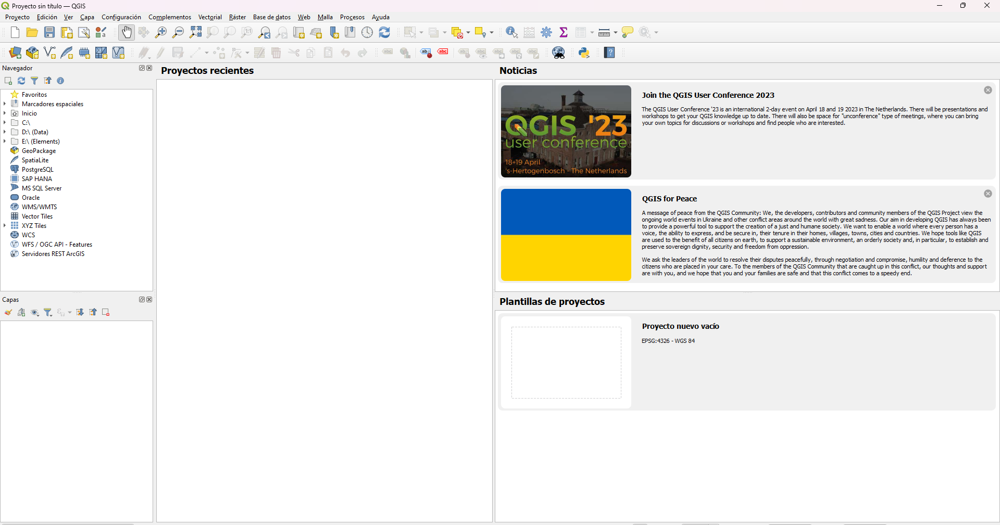

¡Bienvenido a la ventana principal de QGIS!

No te preocupes si tu ventana se ve un poco distinta. A veces hay cambios entre versiones, pero en general las herramientas y menus se mantienen.

Lo primero que vamos a hacer es modificar la interfáz para tener algunas de las herramientas más a la mano. Vamos a desactivar el panel "Explorador" y vamos a activar la barra de "Administrar capas". Para eso vamos a los menus: Ver > Paneles y Ver > Barras de herramientas

Los datos geograficos se suelen manejar como capas (*Layers*). Para cargar una capa en el programa utilizamos las opciones del menú capa. Sin embargo, también podemos usar la barra de herramientas "Administrar capas" (la que acabamos de activar) para acceder a estas opciones de manera más rápida.

Otra parte importante de QGIS son sus complementos. Actualmente existen más de 1000 complementos depositados en el repositorio oficial, cada uno con funciones y herramientas distintas. Todos estos se pueden instalar desde el menú Complementos > Administrar e instalar complementos.

Ya que estamos aquí podemos aprovechar para buscar e instalar el complemento "QuickMapServices" que utilizaremos más adelante. Para eso podemos usar la barra de busqueda y, una vez localizado, lo instalamos desde el boton Instalar complemento en la parte de abajo de la ventana. Tras algunos momentos estará listo y podemos cerrar la ventana. Esto habrá agregado algunos botones nuevos a nuestra barra de herramientas y también estará disponible en el menú Web.

También podemos explorar las opciones de los menus Vectorial y Ráster. En estos menus encontraremos una gran cantidad de herramientas que nos serán útiles más adelante. 

Es importante conocer la barra inferior de QGIS. En esta tenemos información importante acerca de lo que estamos viendo en pantalla. De izquierda a derecha tenemos:
- Las coordenadas en donde se encuentra el cursor de nuestro ratón.
- La escala de lo que estamos viendo.
- Información del zoom y de la rotación del mapa.
- La opción de representar
- La proyeccion o datum del proyecto actual.

Es muy importante tener en cuenta la información que se nos muestra en esta barra pues nos está hablando de las propiedades generales del proyecto que estamos realizando. Especialmente, la proyección que esté asignada al proyecto puede causar muchos problemas en algunos casos por lo que es recomendable asignarla desde un principio. Para esto podemos hacer clic en ella y elegir la deseada en laventana que se abre. Cambiar la proyección después de haber cargado alguna capa puede originar comportmientos no deseados en algunas de ellas por lo que es posible que necesites borrar y volver a cargar las capas problematicas.

Ahora vamos a dejar por un momento a QGIS y vamos a dirigirnos a nuestro navegador para buscar información que podemos utilizar para nuestros mapas en la [siguiente sección](03_fuentes.md).