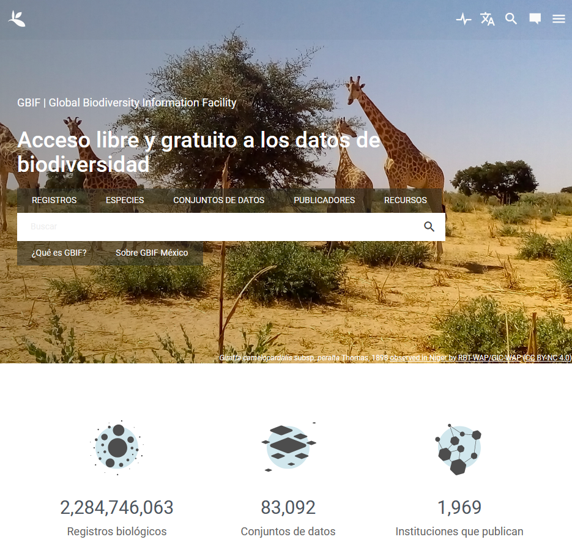

[Volver al inicio](index.md)

## Introducción

Todos sabemos que actualmente podemos encontrar todo en internet, esto incluye desde gatos e información geográfica hasta [información geografica de gatos](https://iknowwhereyourcatlives.com/cat/1b13f78a73). El problema es saber donde buscarla. En esta sección te daré algunos sitios que te pueden ser útiles para obtener información geográfica para mapas y análisis. 

Si lo que quieres es realizar los ejemplos que hacemos en la siguientes secciones puedes descargar los datos directamente desde [aquí](data/).

Disclaimer: dado que la mayoría de mi experiencia es trabajando con especies mexicanas, algunos de los sitios están dirigidos a datos útiles para este país. No obstante, más abajo hay sitios en donde puedes encontrar información de [todo el mundo](#datos-globales).

## Datos para México
### INEGI

Es bien sabido que la gran mayoría de la información geografica base en México es generada por el Instituto Nacional de Estadística y Geografía (INEGI). Mucha de esta información puede ser consultada en el [Mapa Digital de Mexico](http://gaia.inegi.org.mx/mdm6/). Aunque para utilizar en nuestros mapas nos es más util la que está disponible en su [sección de descargas](https://www.inegi.org.mx/temas/topografia/#Descargas). Aquí podemos encontrar mapas relacionados a distintos temas, de diferentes escalas y distintas fechas. Por ejemplo el Continuo de Elevaciones Mexicano ([CEM](https://www.inegi.org.mx/app/geo2/elevacionesmex/)) , mapas de [Uso de Suelo y Vegetación](https://www.inegi.org.mx/app/biblioteca/ficha.html?upc=889463842781), [Hidrologia](https://www.inegi.org.mx/app/biblioteca/ficha.html?upc=889463598435), entre otros.

Algo a tomar en cuenta es que muchas de la información disponible en este sitio puede ser localizada utilizando las claves que usa el INEGI para las cartas topograficas por lo que si buscas información de una zona específica puede ser útil tener el [indice de cartas topograficas](http://geoportal.conabio.gob.mx/metadatos/doc/html/indi50kgw.html) a la mano.

### CONABIO
En nuestro país, otra importante fuente de información es la que recopila la Comisión Nacional para el Conocimiento y Uso de la Biodiversidad (CONABIO) esta la podemos encontrar principalmente en dos sitios: el primero es el [Portal de Geoinformación](http://www.conabio.gob.mx/informacion/gis/). Aquí la CONABIO ha recopilado mapas temáticos, principalmente útiles para estudios relacionados a la biodiversidad. Algunos son tomados directamente del INEGI (como los de división politica). Otros son producto de algunos proyectos relacionados a areas naturales protegidas. Y también hay algunos que son producidos o modificados desde la CONABIO.

El otro sitio que maneja la CONABIO es el de la Red Mundial de Información Sobre la Biodiversidad ([REMIB](http://www.conabio.gob.mx/remib/doctos/remibnodosdb.html)). En esta página podemos buscar información geográfica acerca de las especies que se encuentran de distintas colecciones digitalizadas que se del país.

## Datos globales
Para el caso de datos geográficos que abarcan todo el mundo también tenemos varios sitios a nuestra disposición. Sitios como [Natual Earth](https://www.naturalearthdata.com/downloads/) sirven para descargar mapas generales del contorno de los países. Así mismo, empresas como [ArcGis](https://hub.arcgis.com/) liberan algunas capas que pueden llegar a ser útiles para nuestros estudios. E incluso para consultas y busqueda de algunas localidades podemos recurrir a [Google Earth](https://earth.google.com/web/)

Adicionales a estos, vale la pena mencionar 3 sitios con información que puede resultar muy util para algunos trabajos: son los sitios del USGS, WorldClim y la GBIF

### USGS
El Servicio Geológico de Estados Unidos​​ (USGS) podría considerarse como el INEGI de los Estados Unidos de America. Sin embargo su alcance en recopilación de datos abarca prácticamente todo el planeta gracias, principalmente, al extensivo uso de satelites. Mucha de esta información está disponible de forma gratuita a través del sitio[Earth Explorer](https://earthexplorer.usgs.gov/). Aunque para su descarga requiere crear una cuenta gratuita.

Uno de los más importantes productos que podemos obtener de este sitio son las imágenes generadas por los satelites Landsat. Estas imagenes cubren la totalidad de la superficie terrestre y se generan con mucha regularidad por lo que es posible obtener imagenes muy recientes de cualquier sitio. Además, utilizando datos de reflectancia, estás imagenes sirven para realizar algunos análisis espaciales.

### WolrdClim
Actualmente en biología es muy común realizar análisis de modelado de nicho o modelos de distribución de especies utilizando datos bioclimáticos. Además, estos datos de clima también pueden servir para describir las diferencias entre sitios de estudio o comunidades ecologicas diferentes. Dos fuentes son las más utilizadas para obtener estos datos. [Worldclim](https://www.worldclim.org/data/index.html) y [Chelsa](https://chelsa-climate.org/bioclim/).

En WorldClim se pueden encontrar capas de las 19 variables bioclimáticas y elevación en resoluciones de 10', 5', 2.5', y 30". Estás cubren toda la superficie terrestre y muestrán los patrones de clima "actuales" y algunos escenarios futuros. Las capas de Chelsa también se extienden a todo el planeta pero podemos encontrar otras variables además de las bioclimáticas y estás tienen una resolución de 30". Ambas capas pueden ser usadas para realizar análisis espaciales, pero hay que considerar que fueron generadas con diferentes métodos y pueden tener pequeñas diferencias en algunas regiones. Además, en algunos casos tienen unidades distintas por lo que se tiene que hacer una decisión informada al elegir una o la otra.

### GBIF
Si tu trabajo involucra el estudio de alguna especie y su distibución puede ser que ya conozcas la página del Sistema Global de Información sobre Biodiversidad ([GBIF](https://www.gbif.org/es/)) Este sitio es una colección de datos obtenidos de multiples colecciones alrededor del mundo. Aquí podemos buscar el nombre de una especie y obtener una gran cantidad de información que puede incluir fotografías, localidades, referencias a especimenes de una colección o literatura etc. De especial interés para nuestro tema son las localidades que se encuentran almacenadas en esta base de datos. Estas las podemos descargar y analizar en nuestro proyecto.

Adicionalmente a la base de la GBIF tambien podemos mencionar el sitio de [iNaturalist](https://www.inaturalist.org/). Aunque, generalmente, estos datos son tomados por la base de la GBIF de forma automática, es posible que los registros más recientes no estén disponibles en esta. Además en algunos casos la disponibilidad de las fotografías de iNaturalist puede ser interesante para algunos trabajos.

## Antes de continuar

En este punto vale la pena mencionar que, al igual que en otras actividades del quehacer cientifico, es importante tener mucha precaución al utilizar los datos obtenidos de estas fuentes. Si bien todas lás páginas mencionadas aquí son producto de un trabajo serio e instituciones confiables, los errores ocurren y no es raro verlo en algunas fuentes. Especialmente problematicos son los datos de las identificaciones GBIF y iNaturalist, de lo cual ya se ha hablado [ampliamente](https://scholar.google.com.mx/scholar?hl=es&as_sdt=0%2C5&q=gbif+error+data&btnG=&oq=gbif+). El uso de estos datos para estudios como modelados de nicho requiere una amplia y cuidadosa curación previa.

Aún si nuestro estudio no depende en gran medida de la información geografica aquí mencionada, es importante considerar que las características de los archivos (resolución, extensión, sistema de referencia, etc.) puede variar de una fuente a otra. Esto puede afectar los resultados y la visualización de nuestro trabajo y hay que tenerlo en cuenta.

Finalmente recomiendo ampliamente tomar notas de las fuentes que estamos utilizando y de las modificaciones que les hacemos a los archivos una vez descargados. Esta información nos puede ser útil ya sea porque la tenemos que incluir en nuestras referencias, o simplemente porque queremos compartir un archivo con algún colega y queremos explicarle de donde vino.

Después de esto, ya tenemos archivos con los que podemos trabajar. Ahora sigue conocer que clase de datos estamos viendo en la [siguiente seccion](04_archivos.md).