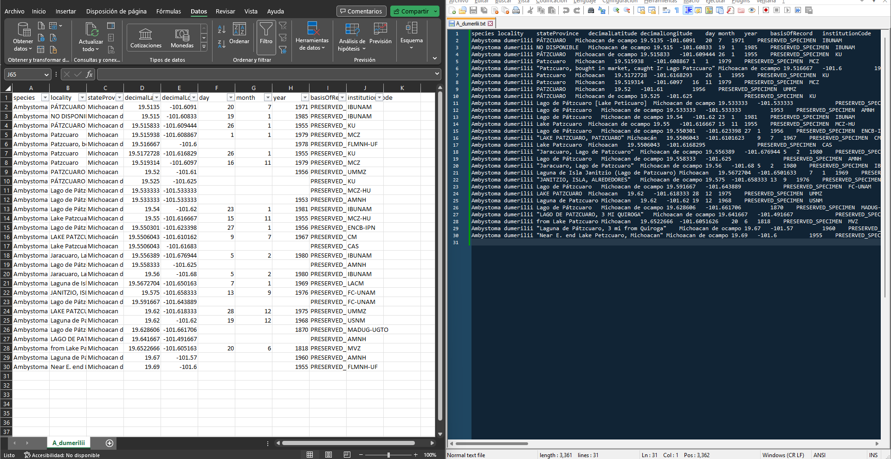
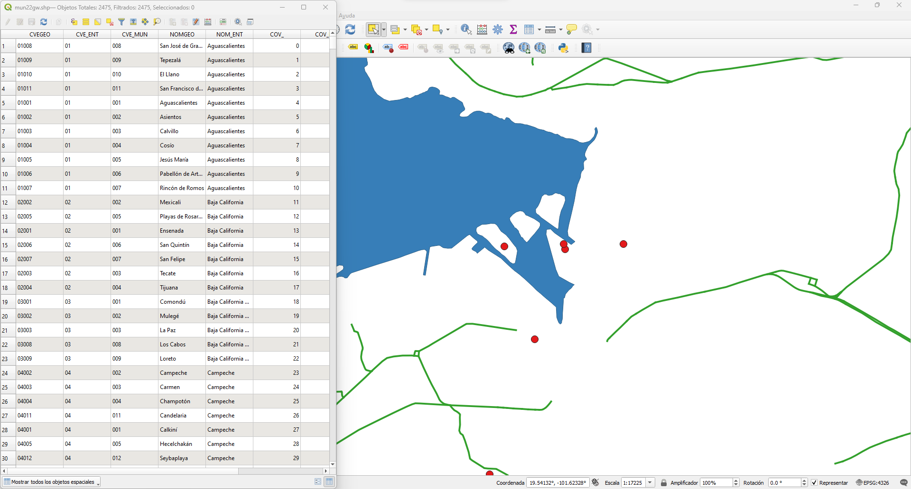

[Volver al inicio](index.md)

## Introducción

En esta sección vamos a conocer los principales tipos de archivo que se manejan en un SIG como QGIS. Vamos a clasificarlos en tres tipos distintos: archivos de texto, archivos vectoriales y archivos ráster.

## Archivos de texto
Como su nombre indica, estos archivos se componen principalmente de texto plano y consisten principalmente en tablas. La gran mayoría se puede abrir en un editor de texto (como blog de notas, nano, notepad++, etc.) pero comunmente los vizualizamos de una manera más comoda en un programa de hoja de calculo (como Excel, Google Sheets o Calc). 

 
    
En un contexto geografico, los archivos de texto sólo pueden ser utilizados para representar puntos. Los más simples pueden contener solo dos columnas: coordedana_x y coordenada_y. Sin embargo pueden contener la información adcicional que querramos, por ejemplo: nombre de la especie, familia, nombre de localidad, fecha de colecta, tamaño de población, etc.

Comúnmente, los archivos de texto suelen ser reconocibles por la extensión del archivo (csv, txt, tsv) aunque no siempre es el caso. Algo a tener en cuenta es que aunque parecen iguales a veces pueden tener una codificación distinta (*i.e.* utf8, ansi, etc.), por lo que si al cargar tu archivo ves que en lugar de acentos aparecen symbolos extraños, quizás debes de cambiar la codificación con la que lo estás leyendo.

## Archivos vectoriales

Los archivos vectoriales son una evolución de los archivos de texto. Generalmente la información que contienen también se representa como tablas, pero además tienen propiedades que les permiten representar puntos, lineas y poligonos. Estos archivos pueden ser leídos por un SIG o algunos lenguajes como R o Python y los formatos de archivo más comunmente usados son el shp y el kml (aunque también pueden venir comprimidos en carpetas zip). 

Ejemplos de vectoriales son capas que contienen al contorno de los paises o estados. Los mapas de carreteras, ríos, areas naturales protegidas, etc. también suelen ser representados utilizando archivos vectoriales.

 

    Ejemplos de archivos vectoriales: a la izquierda la tabla de un archivo vectorial; a la derecha en rojo puntos; en verde lineas; en azul un poligono

## Archivos ráster

El último tipo de archivos que veremos es el archivo ráster. Este tipo de archivos es similar a una imagen. Consiste en una matriz o cuadricula de n x m dimensiones. Cada celda de la matriz representa un area determinada (pixel) y contiene uno o más valores que se relaciona a ese pixel particular. A cada uno de estos valores se les denomina bandas . Este tipo de archivos suelen estar en formatos tif, bill, ascii, grd o incluso png. Y aunque, en algunos casos, es posible visualizarlos en un editor de imagenes, lo más convenientes es utilizarlos en un SIG.

Algunos ejemplos de archivo ráster que podemos encontrar son los modelos digitales de elevacion (DEM por sus siglas en ingllés), los datos bioclimáticos o incluso los modelos de distribución de especies suelen presentarse como archivos ráster.

 
 

Ahora que conocemos los principales tipos de archivo con los que vamos a trabajar pasamos a realizar la [primera práctica](05_Practica_localidades.md)
    
    Ejemplo de un archivo ráster. El segundo es un acercamiento en donde se observa que el archivo se compone de pixeles.