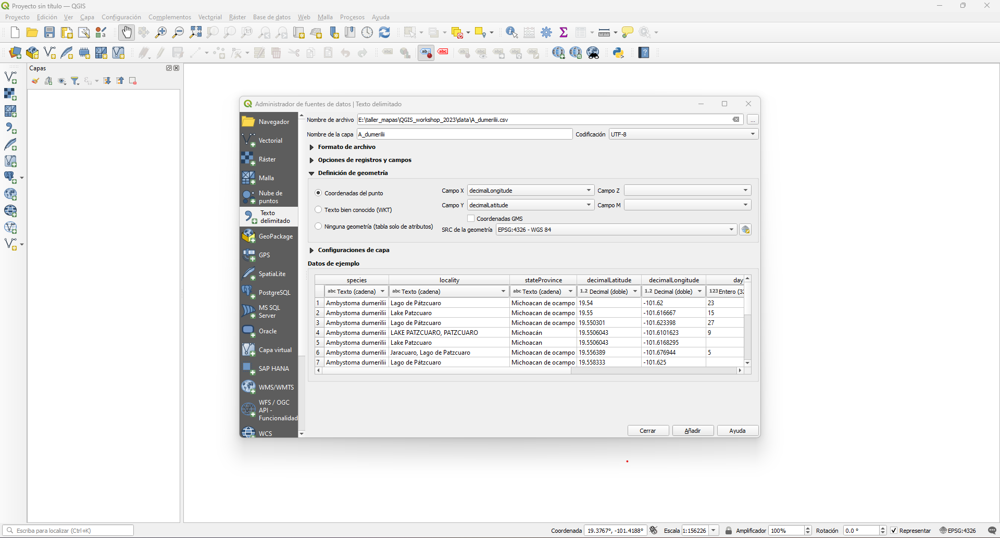
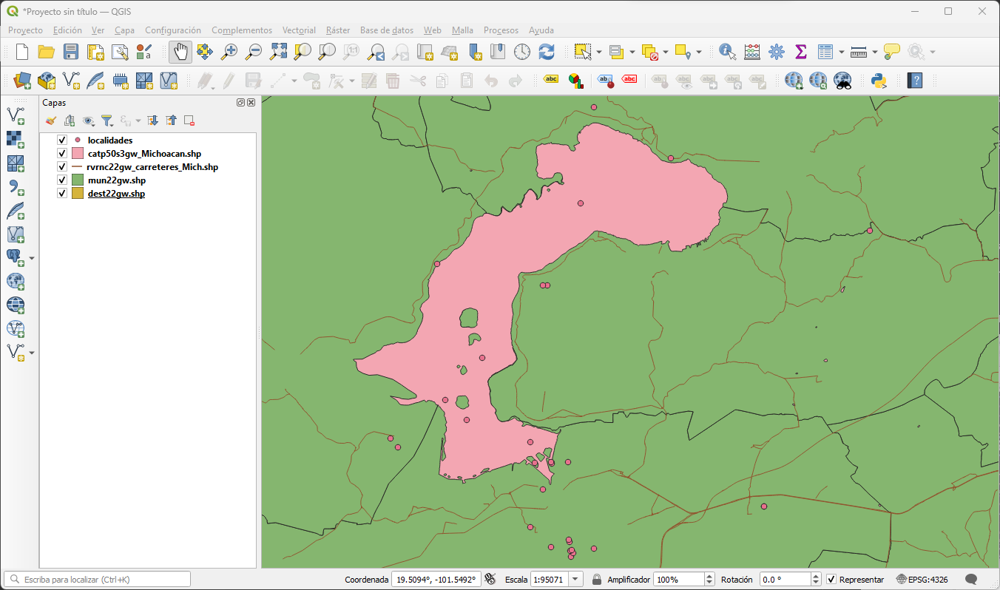
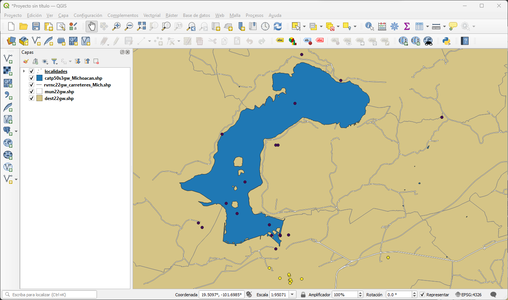
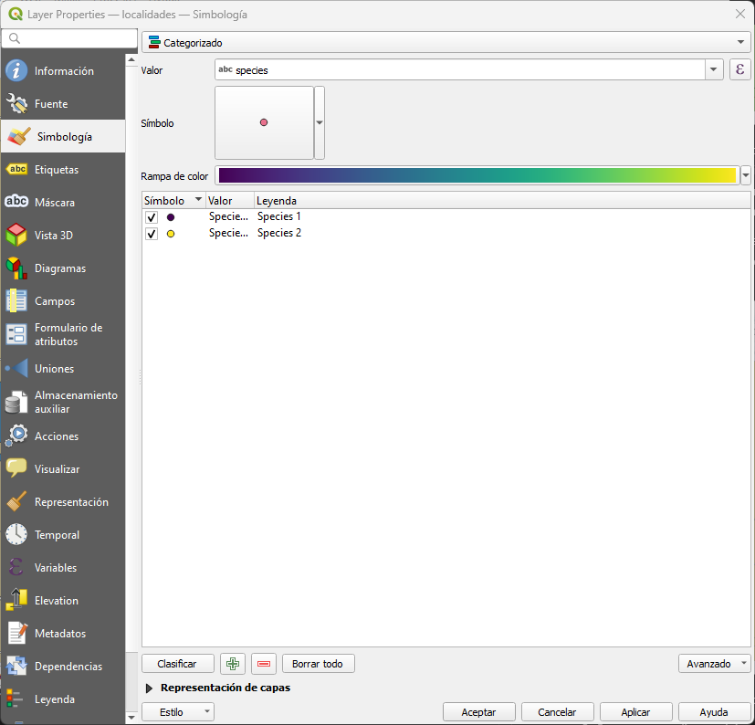
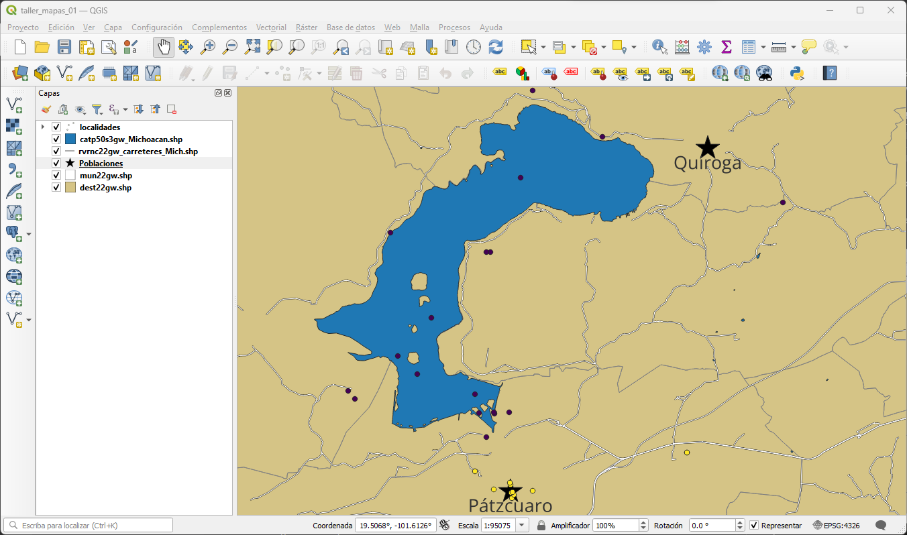
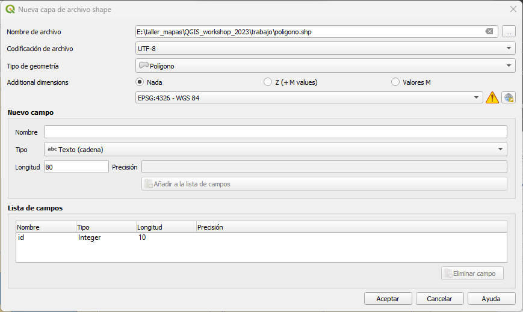
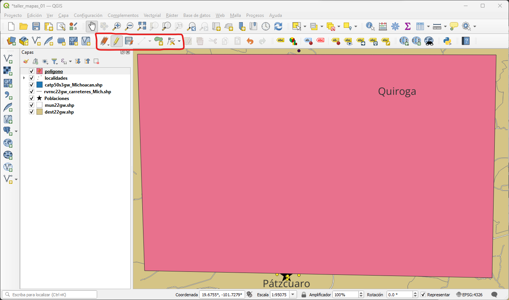
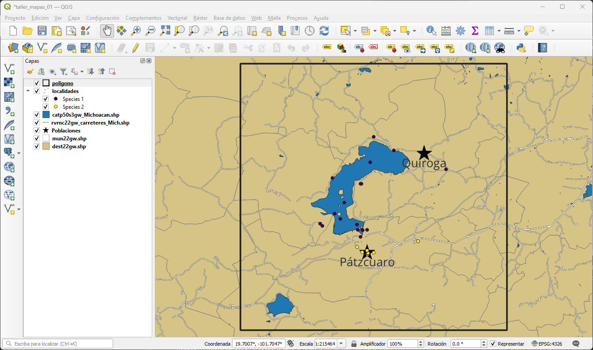

[Volver al inicio](index.md)

## Introducción 

Vamos a crear un mapa de localidades. Estas corresponden a algunas colectas de modificadas de GBIF.

## Elaborando un mapa de localidades

Para este mapa vamos a necesitar los datos de la carpeta de datos disponible en el [GitHub del taller](https://github.com/Zcrass/QGIS_workshop_2023/)

Lo primero será abrir un proyecto nuevo en el QGIS usando el menú proyecto. Después usamos la barra de herramientas para cargar cada uno de los archivos que necesitamos. Cargaremos el archivo de texto localidades.csv y los isguientes vectoriales:
- catp50s3gw_Michoacan.zip
- dest22gw.zip
- mun22gw.zip
- rvrnc22gw_carreteres_Mich.zip

Dependiendo de como se hayan cargado las capas puede que lo que veas no haga mucho sentido. Vamos a darle sentido ordenando las capas en el panel correspondiente como se ve en la siguiente figura:

Probablemente ya queda más claro lo que estmos viendo. La primera capa que tenemos en el panel es una serie de puntos de colecta de dos especies. Estos datos están basados en datos de GBIF. Las siguientes son capas vectoriales y corresponden a los cuerpos de agua y las carreteras del estado de Michoacán y los estados y municipios de la república mexicana. Puedes encontrar más información de estas en el archivo Referencias.md

Ahora que sabemos que es cada capa, vamos a darle un formato apropiado. Para esto podemos dar doble clic a cada capa para abrir las propiedades y en la pestaña de simbologia cambiaremos los colores y estilos a algo que nos guste.

Para el caso de la capa de localidades vamos a utilizar la opción de categorizar en las opciones de simbologia y seleccionamos los valores de "species". Decpues le damos a clasificar y eliminamos los datos vacios. Finalmente aceptamos los cambios.

Para que un mapa sea claro, es importante que este tenga unas referencias espaciales claras. Para esto nos podemos apoyar de rasgos geograficos, como un lago, o de poblaciones y asentamientos. Para nuestro caso, podemos incluir las localidades de Pátzcuaro y Quiroga que son sitios dentro de nuestra area de estudio. Para esto podemos crear otro archivo de texto que incluirá las columnas de: Localidad, Latitud y Longitud:

| Localidad | Latitud | Longitud  |
| ------    | ------- | --------  |
| Quiroga   | 19.6649 | -101.5242 | 
| Pátzcuaro | 19.5163 | -101.6097 |

Este archivo lo guardaremos como CSV delimitado por comas con el nombre de "poblaciones.csv" y después lo cargaremos en QGIS.

Podemos modificar esta capa en sus propiedades. Eligiremos un simbolo y un tamaño distinto que el resto para identificarlos.

Ahora volvemos a entrar a las propiedades de esta capa y seleccionamos la pestaña etiquetas. Aquí elegimos la opción de etiqueta sencilla y el valor de Localidad. Además podemos modificar el tipo de letra y la ubicación de la etiqueta a nuestro gusto.

Ahora es buen momento para crear un poligono que represente los limites de nuestra area de estudio. Esto nos servirá para recortar otras capas y para centrar nuestro mapa más adelante. Para esto vamos al menu 

Capa > Crear capa > Nueva capa de archivo shape

Aquí vamos a crear un nuevo archivo llamado poligono.shp y elegimos la geometría tipo poligono. Los archivos vectoriales aceptan la creación de campos de datos. En nuestro caso no necesitamos ninguno además del campo por default "id". En caso de ser necesario, esta ventana te permite crear nuevos campos adicionales.

Esto nos genera una capa vacia que podemos seleccionar en el panel de capas. Trás seleccionarla nos vamos a la Barra de digitalización (recuadro rojo en la imagen abajo) y seleccionamos las opciones de Conmutar edición y Añadir poligono. Con esta herramienta crearemos un cuadrado sobre nuestro mapa. No tiene que ser perfecto pues en un momento lo vamos a modificar.

Vamos a usar la Herramienta de vertices de la barra de digitalización y daremos clic derecho sobre nuestro poligono. Esto abrirá el panel del Editor de vertices en donde modificaremos los cuatro vertices colocando las siguientes coordenadas:

|       |   x   |   y   |
| ----- | ----- | ----- |
|   0   | -101.8 | 19.8 |
|   1   | -101.4 | 19.8 |
|   2   | -101.4 | 19.4 |
|   3   | -101.8 | 19.4 |
|   4   | -101.8 | 19.8 |

Después de esto desactivamos la opción de Conmutar de edición y guardamos los cambios de la capa. Finalmente, podemos entrar a las propiedades dee esta capa y editarla en la pestaña de Simbología. Utilizaremos la opción de Línea exterior: Línea simple para conservar sólo el margen del poligono. Al final nuestro mapa se verá más o menos como la siguiente imagen:

Con esto ya tenemos listas nuestras capas de texto y vectoriales. [En la siguiente practica](06_Practica_diseñador.md) veremos como utilizar el diseñador de composiciones para crear nuestra figura y como agregaremos archivos raster.

