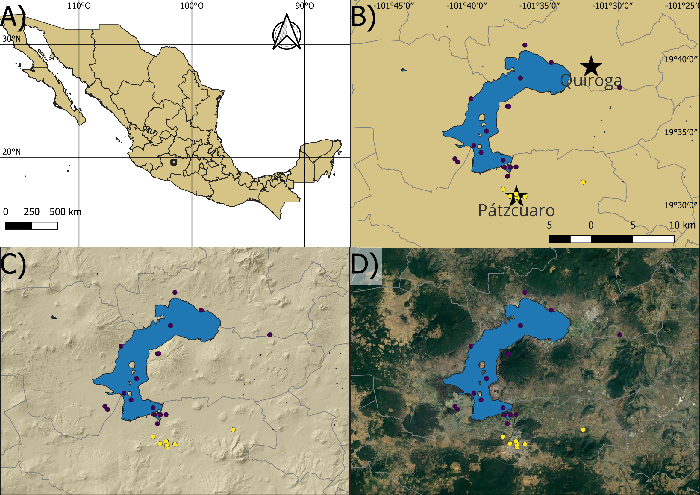

[Volver al inicio](index.md)

## Introducción 

Ahora vamos a crear una figura que se va a componer de cuatro paneles con mapas indicando diferentes aspectos de la zona de estudio.

La figura la vamos a crear utilizando el diseñador de impresiones. Esta es la herramienta de QGIS para diseñar figuras. Aquí vamos a conocer las principales herramientas con las que cuenta y como las podemos aprovechar para crear nuestros mapas.

## El diseñador de impresiones

El Administrador de composiciones se encuentra en el menú Proyecto. Aquí vamos a crear una nueva composición llamada Mapa 01 y la vamos a abrir. La nueva ventana contiene herramientas útiles para crear la figura de un mapa. En la parte izquierda tenemos herramientas para agregar elementos a nuestra figura. Mientras en la derecha tenemos el panel de Elementos, en donde se listarán los elementos que agreguemos, y el panel de Propiedades que nos mostrará las distintas propiedades que podemos modificar de cada elemento.

Para que nuestro mapa sea claro necesitamos colocar al lector en un contexto, por lo que el primer mapa que vamos a crear es un mapa de todo el país en donde se identifique nuestra area de estudio. Para esto vamos a dar clic en la herramienta Añadir mapa y colocaremos el primer mapa. 

Dado que el primer panel debe mostrar todo el país necesitamos modificar la extensión en las Propiedades del elemento. Podemos revisar las coordenadas extremas del país con ayuda del cursor en la ventana principal de QGIS. Ya que estamos ahí, podemos desactivar las capas de localidades, cuerpos de agua, poblaciones y municipios para que no sean visibles en este mapa. Para esto sólo necesitamos hacer clic en el ☑ da cada capa dentro del Panel de capas. Así solo serán visibles las capas de estados y el poligono que creamos previamente.

De regreso en la ventana del Diseñador, vamos a editar nuestro pirmer mapa para hacerlo más completo. Dentro de las Propiedades del mapa, vamos a la opción de Cuadriculas, agregamos una nueva y le damos clic en modificar. Dentro de este submenú vamos a elegir un intervalo de 10 grados para ambos ejes. Vamos a dejar este mapa sin marco pero vamos a dibujar las coordenadas activando la opción correspondiente. Vamos a usar la opción decimal con sufijo con una precisión de coordenada de 0. Vamos a editar las opciones para sólo mostrar las coordenadas a la izquierda y arriba, desabilitando las opciones de derecha y abajo. Además,vamos a optar por mostrar las coordenadas en el marco interior.

Además de esto, también podemos añadir la rosa de los vientos y una escala al mapa. Para eso usamos las opciones respectivas del panel de la derecha. Cada uno de estos elementos nuevos tienen propiedades que podemos modificar. Aunque por ahora sólo cambiaremos el tamaño y la posición de estos. Finalmente haremos clic de nuevo en el mapa y vamos a activar las opciones bloquear capas y bloquear estilos para las capas. Con esto evitaremos que los cambios que hagamos en la ventana principal de QGIS lo afecten hasta que lo volvamos a desbloquear.

Ahora vamoa a añadir un segundo mapa. De nuevo usando la herramienta añadir mapa. A este nuevo mapa le vamos a modificar la extensión acorde a las que usamos para crear el poligono del area de estudio. Para este mapa vamos a usar las capas de municipios, cuerpos de agua, localidades y poblaciones entonces debemos activarlas en la ventana principal de QGIS. En caso de que los cambios no se vean reflejados en nuestro mapa necesitamos actualizar la vista con el botón de la parte superior izquierda.

En este mapa también vamos a crear una cuadricula. En este caso utilizaremos la opción Marco y anotaciones solamente en el menú desplegable de tipo de cuadricula. Estableceremos un intervalo de 0.083333333333 (*i.e.* 5 arcominutos) y dibujaremos las cordenadas utilizando el formato de grados, minutos, segundos y las estableceremos en el marco interior de los lados izquierdo y arriba. Luego podemos incluir una escala asegurandonos de que en las propiedades de esta esté seleccionado el mapa 2. Finalmente bloqueamos las capas y el estilo de estas para asegurarnos de que no haya cambios.

Con estas herramientas ya podemos hacer un buen mapa para presentar en nuestros manuscritos. Sin embargo, en la [siguiente sección](07_practica_rasters.md) veremos como podemos crear y editar un archivo raster para complementar nuestra figura.

