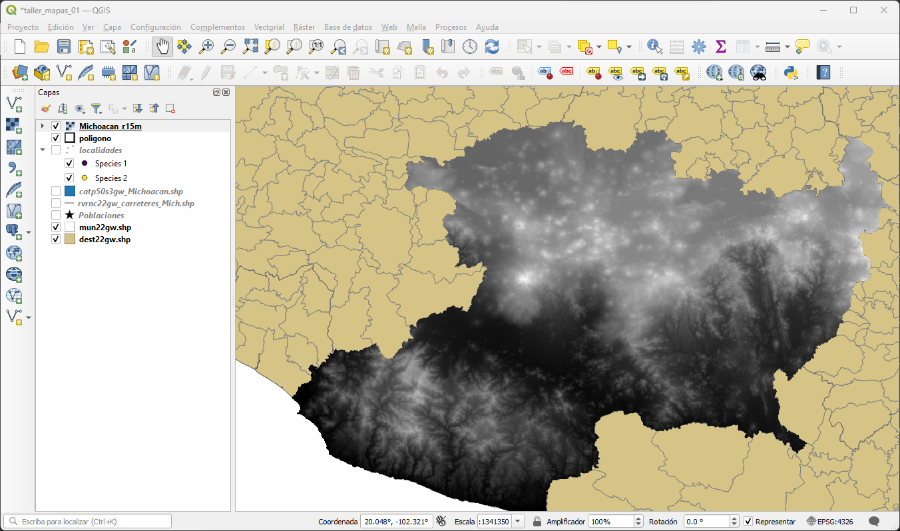
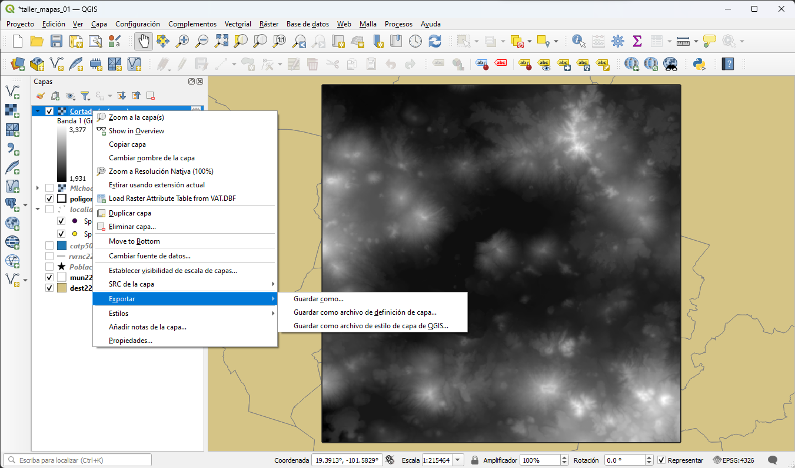
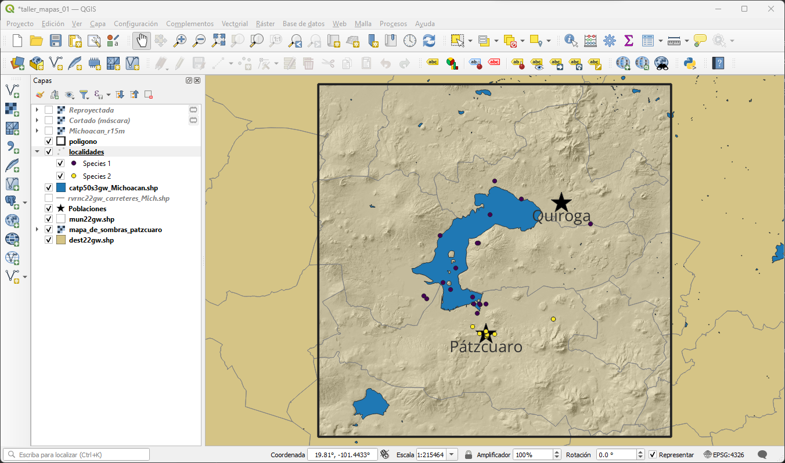
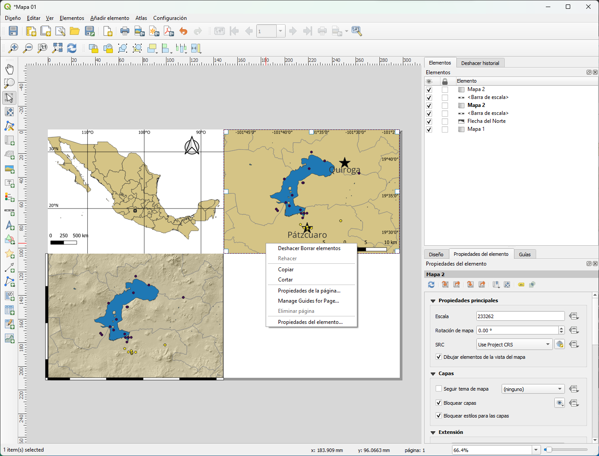
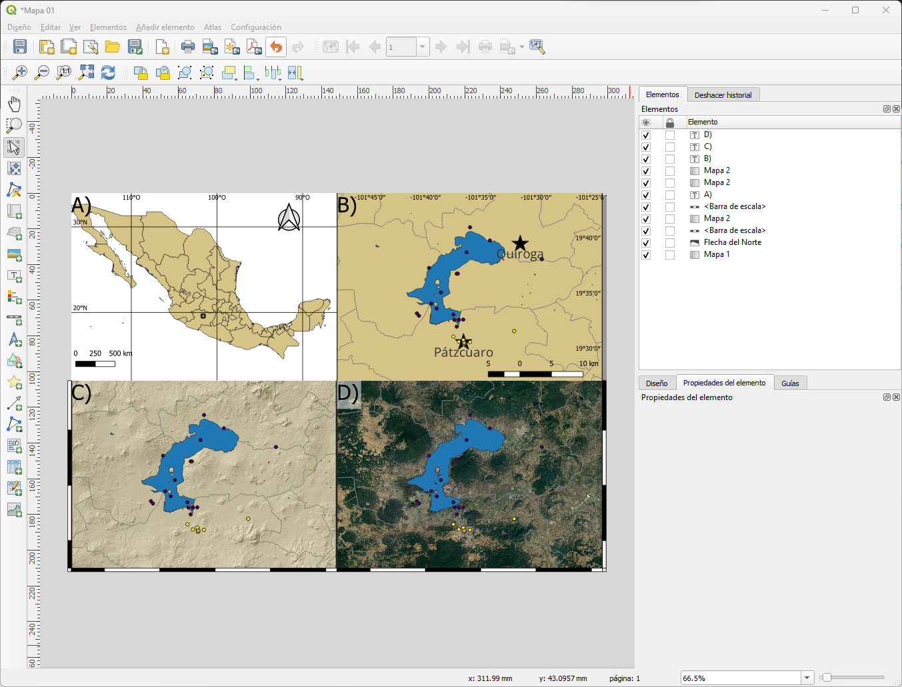
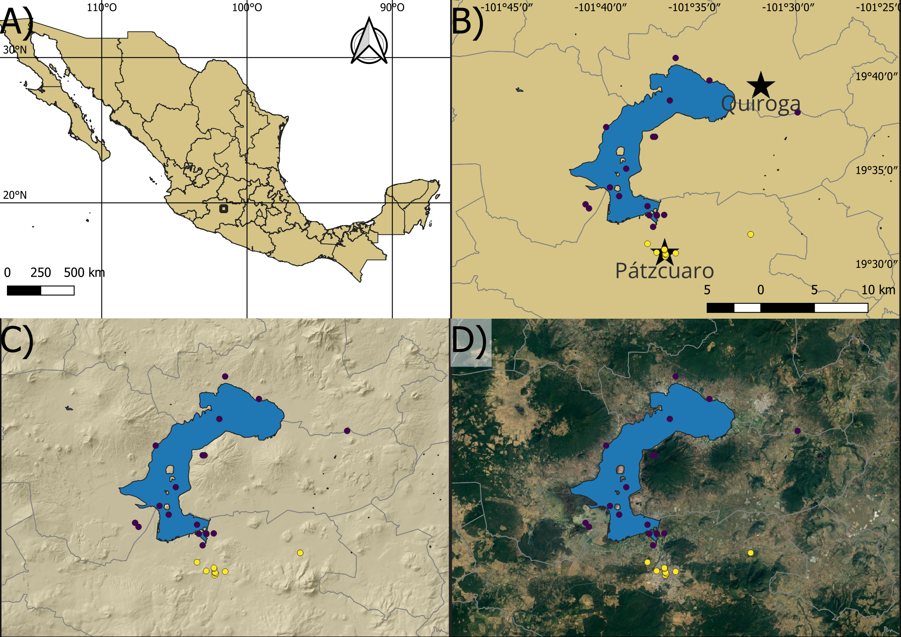

[Volver al inicio](index.md)

## Introducción

Como mencionamos en la [sección 4](04_archivos.md) las imagenes raster son un tipo de archivo que podemos utilizar en nuestros mapas. Estos se caracterizan por formarse de pixeles y contener datos en forma de bandas. El manejo de estos archivos es un poco distinto del que hemos utilizado para los archivos de texto y vectoriales por lo que vale la pena mencionarlos en su propia sección.

## Uso de capas raster

Lo primero que vamos a hacer es cargar una capa raster. En este caso vamos a usar la opción correspondiente de la barra de herramientas administrar capas. Vamos a utilizar el Continuo de Elevaciones Mexicano (CEM) del estado de Michoacán. Debemos de tener en cuenta que esta capa cuenta con un sistema de referencia llamado ITRF 2008.

Una ves cargado podemos ver los patrones de elevación de todo el estado de Michoacán. Esta capa puede ser un poco pesada para algunos equipos. Si este es tu caso te recomiendo que desactives la capa en el panel de Capas haciendo clic en el ☑. De esta forma la capa estará cargada en el programa pero no se visualizará lo que puede ahorrar algo de memoria.

Para no tener que lidiar con toda la capa, vamos a recortar esta utilizando el poligono del area de estudio que creamos en la [seccion 5](05_Practica_localidades.md). Para esto vamos al menú:

Ráster > Extacción > Cortar raster por capa de máscara...

En la nueva ventana usaremos como capa de entrada el CEM de Michoacán y como máscara el poligono que habíamos creado. En las opciones de parametros avanzados tenemos la opción de guardar la capa como un nuevo archivo o como un archivo temporal. QGIS tiene la capacidad de guardar las capas como archivos temporales, estos son visibles y utilizables mientras el programa esté abierto, sin embargo, una vez que cerramos el programa estas capas son eliminadas. Por el momento dejaremos esta capa como un archivo temporal.

Tras ejecutar la herramienta tendremos la capa recortada a nuestra area de estudio. Nota el icono a la derecha del nombre de la capa que nos avisa que ese es un archivo temporal. En caso de que cambiemos de opinión y querramos guardar la capa en un archivo podemos dar clic derecho en la capa y usar la opción de 

Exportar > Guardar como...

Si bien esta capa nos da indicios del relieve y la elevación del area, visualmente puede no ser muy informativa. Para mejorar su visualización podríamos entrar a las propiedades de la capa y modificar la simbología de esta para utilizar otra escala de colores. Esto puede ser muy útil en algunos casos como los modelos de distribución de especies o las variables bioclimaticas. Sin embargo, para un DEM una mejor opción puede ser crear un mapa de sombras (Hillshade) Esto nos permite visualizar el relieve de una manera más clara.

El primer paso para crear un mapa de sombras es contar con un DEM cuyo sistema de referencia esté en metros. Como mencionamos previamente, la capa que estamos utilizando es ITRF 2008, el cúal utiliza coordenadas geográficas como sistema de referencia. Para poder utilizar esta capa primero la tenemos que reproyectar (es deciir cambiar el sistema de referencia que utiliza). Para esto vamos a:

Ráster > Proyecciones > Combar (reproyectar)...

En la ventana que se abre seleccionamos la capa recortada como capa de entrada y como SRC objetivo vamos a utilizar EPSG: 32614 - WGS 84 / UTM zone 14N. Este lo vamos a buscar utilizando el icono de la derecha y seleccionamos la opcion de SRC predefinidos. De nuevo vamos a dejar esta como una capa temporal. Una vez ejecutada la herramienta deberiamos tener una capa visualmente igual a la que ya teníamos, sin embargo, si revisamos la información de la capa dentro de sus propiedades veremos que el sistema de referencia es distinto.

El siguiente paso será crear el mapa de sombras, para esto vamos a: 

Ráster > Análisis > Mapa de sombras (Hilshade)...

En esta ventana vamos a elegir la capa que reproyectamos como capa de entrada. Esta ves vamos a guardar esta capa como un archivo por lo que elegimos esta opción dentro de la sección de parámetros avanzados y le daremos nombre a nuestro nuevo archivo tiff.

Finalmente vamos a reorganizar las capas y modificaremos la transparencia del mapa de sombras en sus propiedades.

Con esto podemos regresar al diseñador y crear un nuevo mapa. Para conservar las propiedades del mapa que habíamos creado podemos simplemente hacer una copia de este mapa con las opciones de copiar y pegar que se depliegan al hacer clic derecho en el elemento. Después sólo desbloqueamos las capas y actualizamos la vista para aplicar los cambios. Adicionalmente, modificaremos la cuadricula para quitar las coordenadas y en su lugar utilizaremos un marco de cebra.

Para nuestro último mapa vamos utilizar una capa raster de Google Earth. Para esto vamos a utilizar el complemento de QuickMapServices que instalamos. Primero tenemos que habilitar las fuentes en el menú:

Web > QuickMapServices > Settings

En la pestaña More services utilizamos la opción Get contributed pack. Después de unos momentos tendremos habilitadas nuevas opciones en el menú del complemento. Ahora vamos a habilitar los mapas de satelite en:

Web > QuickMapServices > Google

Desactivamos la capa del mapa de sombras y volvemos a reorganizar las capas. Ahora podemos ir al diseñador y crear una nueva copia de nuestro mapa. Finalmente utilizaremos la herramienta añadir etiqueta para colocarle etiquetas que identifiquen a cada panel de nuestra figura. Nuestro resultado final quedará de esta forma:

Lo último que vamos a hacer es exportar nuestra imagen. QGIS nos da un par de opciones para esto. En la parte superior del diseñador tenemos las opciones de Exportar como imagen y Exportar como PDF. Dependiendo de cual va a ser el uso que le den a su mapa pueden utilizar una u otra opción. Algunas revistas cientificas solicitan que los mapas sean exportados como archivos vectoriales o que tengan una cantidad de DPI mínima. En QGIS, exportar como imagen da la posibilidad de escoger la cantidad de PPP (o DPI) que deseen utilizar en su figura. Mientras la opción de exportar en PDF da la posibilidad de exportar como vectorial. Además, es posible exportar directamente como un archivo vectorial en formato SVG, sin embargo, esta opción tiene algunos problemas y no es recomendado usarla (como el mismo QGIS explica si hacemos clic en dicha opción). Independientemente de la opción escogida, ahora tendríamos un mapa visualmente agradable y con las características necesarias para una publicación.

Con esto concluiría esta guía introductoria a QGIS y al diseño de mapas. Sin embargo, como se mencionó al principio, QGIS es una herramienta muy poderosa y existe una gran cantidad de información disponible hacerca de su uso. Por lo que te invito a que sigas experimentando con el programa y no límites tu creatividad a lo expuesto aquí. 

Ante cualquier duda con respecto a este taller puedes contactarme y trataré de ayudarte a resolverlas.

Si tienes comentarios o sugerencias de como mejorar este taller también son bienvenidas.

¡Éxito en tu investigación!

-SGD

